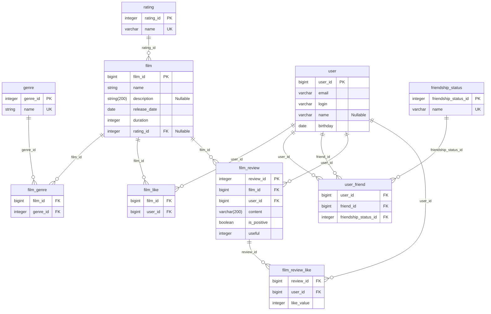

# java-filmorate
Template repository for Filmorate project.

---

## DataBase



#### Database Main Queries

1. Get popular films
```sql
WITH top_films AS (
    SELECT
        f.film_id,
        COUNT(user_id) AS cnt 
    FROM film AS f
    INNER JOIN film_like AS fl
        ON f.film_id = fl.film_id
    GROUP BY f.film_id
    ORDER BY cnt DESC
    LIMIT {top_count}
)
SELECT
    f.*
FROM film AS f
INNER JOIN top_films AS t
    ON f.film_id = t.film_id
```
2. Get intersection of friends
```sql
SELECT f.*
FROM user AS f

INNER JOIN user_friend AS user1_fl
    ON f.user_id = user1_fl.friend_id
    AND user1_fl.user_id = {user1}
INNER JOIN friendship_status AS user1_fl_status
    ON user1_fl.friendship_status_id = user1_fl_status.friendship_status_id
    AND user1_fl_status.name = 'ACCEPTED'


INNER JOIN user_friend AS user2_fl
    ON f.user_id = user2_fl.friend_id
    AND user2_fl.user_id = {user2}
INNER JOIN friendship_status AS user2_fl_status
    ON user2_fl.friendship_status_id = user2_fl_status.friendship_status_id
    AND user2_fl_status.name = 'ACCEPTED'
```
